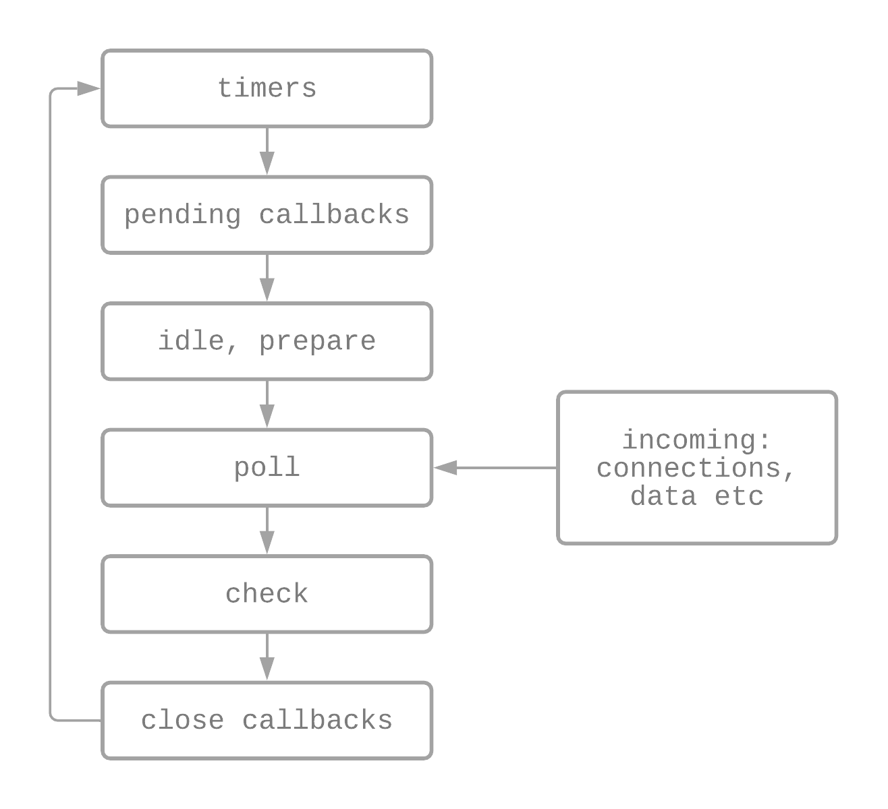

# AJ 1.1 Node.js
{: .fs-9 .fw-700 .no_toc }

## Table of contents
{: .no_toc .text-delta }

- TOC
{:toc}

---

Node.js låter oss använda JavaScript i backend, vilket innebär att vi kan ha samma språk både server-side och client-side. Fullstack, helt enkelt!


## Vad är Node.js?

- Backend JavaScript runtime miljö
- Byggt på Chromes V8 JavaScript engine
- Använder en event-driven, asynkron, non-blocking I/O modell
- Använder en single-thread event loop
- Cross-plattform
- Open-source

Med Node.js kan vi skapa webservrar och nätverksverktyg med JavaScript. Det bygger på en samling *moduler* som hanterar olika kärnfunktioner. Det finns bl.a. moduler för:

- file system I/O
- networking (DNS, HTTP, TCP, TLS/SSL, DP)
- binary data (buffers)
- cryptography functions (kryptografi)
- data streams (strömmar)

Målet när Node.js skapades var att kunna göra en förfrågan till en databas, och istället för att vänta på svaret så ger du det en callback, och sen går direkt vidare till nästa förfrågan. När svaret sedan kommer från den första förfrågan, så kan du exekvera callbacken. Detta gör Node.js genom sin *event loop*. [^1]

### Filosofi

Ryan Dahl, som har skapat Node, utvecklade en filosfi som hela Node.js nu är baserad på. [^2] Ledorden är att hålla allt litet och enkelt.

- **En liten kärna** - minsta möjliga som behvövs för uppgiften, med begränsad funktionalitet
- **Små moduler** - använda små moduler för att tillsammans strukturera upp hela koden till ett program, varje modul gör en sak riktigt bra
- **Small surface area** - bara visa det som behöver visas, typ visa en funktion för att komma in i programmet, och sen håll resten dolt
- **Designa enkelt istället för perfekt** - försök att skapa en modell av verkligheten istället för verkligheten

---

## Hur Node.js fungerar

Till skillnad från t.ex. PHP så är Node.js *non-blocking* (oblockerande). Blockerande innebär att medan en förfrågan görs, så väntar programmet på att få svaret och blockar de flesta andra funktioner tills det har fått det. Node fungerar alltså inte så, utan kan direkt efter en förfrågan eller ett kommando gå vidare till nästa i väntan på svaret.

*I/O* är kommunikation mellan ett systems disk och nätverk, t.ex skriva/läsa data, HTTP-requests, prata med databasen. I/O operationer är väldigt långsamma jämför med att jobba mot RAM eller CPU.

JavaScript är *single-thread* (singeltrådat, läs mer om det [här]({{ site.baseurl }})), men Node.js kan ändå utföra flera operationer samtidigt.

### Event loop

Hur fungerar då Nodes event loop?

- Får en förfrågan från vår kod och exekverar den
- Är förfrågan asynk eller en I/O-operation så läggs den i en thread pool (trådpool)
- Loopen tar sen nästa förfrågan från koden och exekverar den, lägger den i trådpoolen etc
- När en förfrågan är klar (har fått svar), så lägger Node callbacken som ville ha förfrågan i kö för att sen exekveras
- Node håller koll på alla asynkrona förfrågningar, och event loopen loopar hela tiden igenom dem tills alla blir klara

#### En förenklad överblick av event loopens faser [^3]
{:.no_toc}

{: width="400"}

- **timers** - exekverar callbacks schemalagda av `setTimeout()` och `setInterval()`
- **pending callbacks** - exekverar I/O callbacks som skjutits upp
- **idle, prepare** - används bara internt
- **poll** - hämtar nya I/O events från koden, exekverar I/O relaterade callbacks (nästan alla utom *close callbacks* och de som exekveras i *timers* och *check*), här kan Node blocka om det är nödvändigt
- **check** - `setImmediate()` callbacks anropas
- **close callbacks** - t.ex. `socket.on('close', ...)`

### Reactor pattern

I moderna operativsystem så finns mekanismen *demultiplexer* (synchronous event demultiplexer eller event notification interface). Node skickar requests/förfrågningar (events) samt en handler (i form av en callback) per request till demultiplexern. Den i sin tur bevakar "ärendet", och när en request har fått svar returneras det till Nodes event loop. [^4]

Alla OS hanterar demultiplexern olika, därför har Node-teamet även skapat biblioteket *libuv* för att hantera asynkrona I/O's.

### Moduler

Node.js har som sagt många små moduler, som var och en hanterar en funktionalitet. Modulerna fungerar självständigt i förhållande till varandra, så de krockar aldrig.

Node har tre olika typer av moduler

1. Core modules
2. Local modules
3. 3rd party modules

#### Core modules [^5]

Core modulerna är kärnan i Node och innehåller minsta möjliga funktionalitet för att Node ska fungera. De laddas in automatiskt när Node startar, men vill du använda dem i din applikation måste du importera dem också. Detta gör du enkelt genom t.ex. require-funktionen.

```js
const <module> = require('<module_name>');

// example
const url = require('url');
```

Några exempel på core moduler

| Core module | Description |
|--|--|
| `http` | klasser, metoder och event för att skapa Node.js server |
| `url` | metoder för identifiering och tolkning av URL-er |
| `querystring` | metoder för att hantera förfrågnings-strängar |
| `path` | metoder för hantering av sökvägar |
| `fs` | klasser, metoder och events för att jobba med I/O av filer |
| `util` | verktyg (utilities) för att programmera i Node |

#### Local modules [^6]

Lokala moduler är moduler är modular du skapar lokalt i din Node app. Om du ska skapa en Node modul så ska den sparas i en separat JS fil. Ett enkelt exempel som loggar errors till consolen:

```js
const errorLog = {
  error:function (error) { 
    console.log(`Error: ${error}`);
  }
};

module.exports = errorLog
```

I slutet av filen assignar vi vårt objekt till `module.exports`, vilket innebär att vi säger till Node att det här är en modul. Samma går att göra med funktion och variabler. För att använda en lokal modul måste vi använda require-funktion precis som med core moduler, men vi måste specificera pathen.

```js
const myErrorLogModule = require('./ErrorLog.js');
```

Nu kan vi använda modulen som ett objekt och kalla alla dess funktioner med dot notation, som `myErrorLogModule.error()`.

```js
myErrorLogModule.error('something went wrong');
```

#### 3rd party modules

Tredjepartsmoduler går att ladda ner med npm och requiras med samma syntax.

```js
const <package> = require('<package_name>');

// example
const express = require('express');
```

---

## Mer läsning

- [libuv.org](https://libuv.org/)
- [Nikhil Marathe - An Introduction to libuv](https://nikhilm.github.io/uvbook/index.html)

---

## Referenser

[^1]: [Pablo Regen - Node.js: what it is, when and how to use it, and why you should](https://www.freecodecamp.org/news/node-js-what-when-where-why-how-ab8424886e2/)
[^2]: [Ankit Gupta - Understanding the Basics of Node.js](https://www.digitaldoughnut.com/articles/2017/july/understanding-the-basics-of-node-js)
[^3]: [Node.js docs - What is the event loop?](https://nodejs.org/de/docs/guides/event-loop-timers-and-nexttick/#what-is-the-event-loop)
[^4]: [David Wisdom - A beginner's guide to Node.js](https://medium.com/@wizdave97/understannode-js-97aec4359af)
[^5]: [Tutorial Teacher - Node.js Modules](https://www.tutorialsteacher.com/nodejs/nodejs-modules)
[^6]: [Tutorial Teacher - Node.js Local Modules](https://www.tutorialsteacher.com/nodejs/nodejs-local-modules)