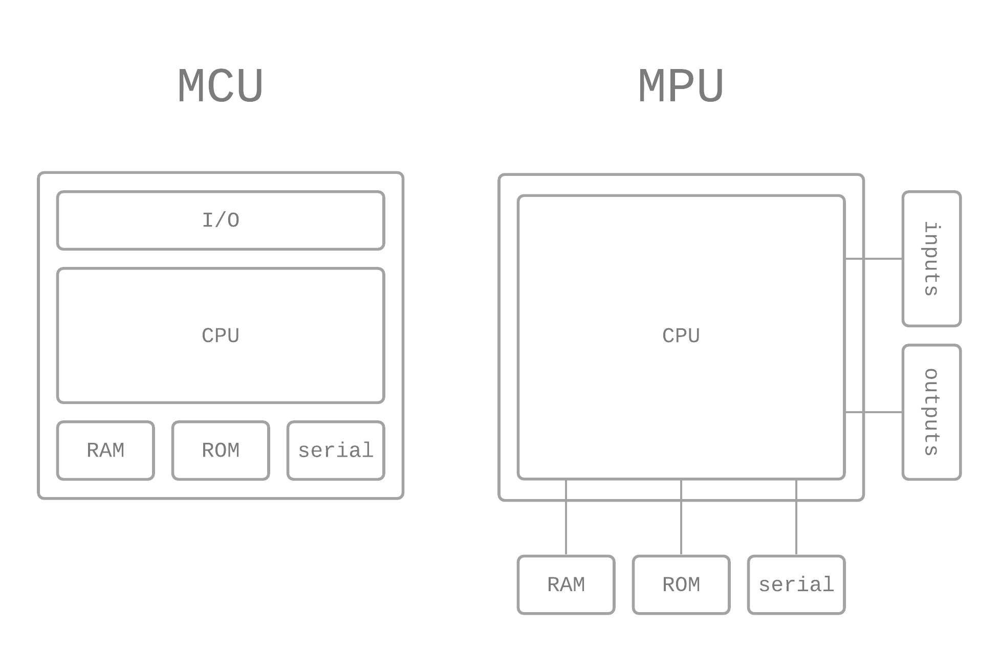

# AJ 1.7 JavaScript i integrerade system
{: .fs-9 .fw-700 .no_toc }

## Table of contents
{: .no_toc .text-delta }

- TOC
{:toc}

---

## Vad menas med integrerat system?

Det finns många ställen där JavaScript är användbart även utanför webben. Överallt finns en massa prylar och system som inte är rena datorer, utan inbyggda/integrerade.

Det är viss skillnad på begreppen *inbyggda system* och *integrerade system*.

### Inbyggda system

- Specifikt designade för *en* uppgift (iPods, medicinsk utrustning, controllers i bilar)
- Specialiserad stack
- Specialbyggd hårdvara och mjukvara
- Kombination av mjukvara och hårdvara med begränsad eller specifik kapabilitet

#### Fördelar med inbyggda system
{:.no_toc}

- Låga strömåtgångar
- Kontrollerad prestanda

### Integrerade system

- Byggda med ett mer generellt OS och standard hårdvara
- Specifikt designat system och tillämpning på generell hård- och mjukvara
- Exempel är t.ex. en skrivare, som ju kan göra olika saker

#### Fördelar med integrerade system
{:.no_toc}

- Lägre utvecklingskostnad (fler vanliga delar)
- Högre säkerhet och pålitlighet (lättare att testa, färre rader kod)
- Produkter kan bli färdiga snabbare

### Exempel

Några exempel på integrerade system

- Laddstolpar för elbil
- Kopiatorer och skrivare
- Systemkameror
- Home assistants
- Hemlarm
- Routrar

---

## Internet of Things

Sakernas Internet (Internet of Things eller IoT) beskriver fysiska föremål som är utrustade med sensorer, bearbetningskapacitet, programvara och annan teknik, och som är anslutna till och utbyter data med andra enheter och system via Internet eller andra kommunikationsnät. [^1]

Integrerade system och IoT går lite hand i hand, där integrerarde system blir allt vanligare och enklare sätt att jobba med IoT. [^2]

---

## Mikrokontroller och microprocessorer

Gemensamt för alla integrerade system är att de bäddar in mikrokontroller och mikroprocessorer.

I en mikrokontroller (MCU) finns I/O, RAM, CPU, ROM integrerat. I en mikroprocessor(MPU) så är komponenterna kopplade extern, men i en mikrocontroller har vi allting internt.

MCU är billigare och enklare att använda än MPU. En MCU använder ofta ett realtidsoperativsystem (RTOS) eller körs utan operativsystem, och ger realtidssvar och mycket deterministiska reaktioner på externa händelser.

En MPU kör oftast ett generellt operativsystem, t.ex. Windows, Linux eller MacOSX, som ger icke-deterministiska realtidssvar. Det finns vanligtvis ingen garanti för när en uppgift kommer att slutföras. [^3]

#### Jämförelse mellan MCU och MCP [^3]
{:.no_toc}

|  | MCU | MPU |
|---|---|---|
| **CPU** | Mindre | Mer |
| **RAM** | Mindre | Mer |
| **Flash** | Mindre | Mer |
| **OS** | Inget eller RTOS | Generellt |
| **Svårighetsnivå** | Svårare | Lättare |
| **Elförbrukning** | Lägre | Högre |
| **Kostnad** | Lägre | Högre |
| **Deterministiskt** | Ja | Nej (vissa undantag) |
| **Storlek** | Liten | Större |

---

## Referenser

[^1]: [Wikipedia - Internet of Things](https://en.wikipedia.org/wiki/Internet_of_things)
[^2]: [Camille Siegel - The Internet of Things and integration: How they work together](https://blog.axway.com/internet-of-things/iot-integration)
[^3]: [Microsoft Docs - Overview of Azure IoT device types](https://docs.microsoft.com/en-US/azure/iot-develop/concepts-iot-device-types)
