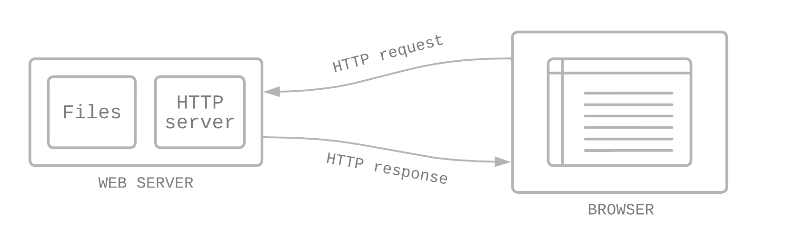

# BE 1.13 Webbservrar
{: .fs-9 .fw-700 .no_toc }

## Table of contents
{: .no_toc .text-delta }

- TOC
{:toc}

---

## Vad är en webbserver?

Begreppet webbserver kan antingen referera till hårdvara eller mjukvara, eller båda två i kombination. [^1]

- **Hårdvara** - en fysisk dator som hostar en eller flera webbsiter, vilket innebär att alla filer och sidor till siten är tillgängliga på den datorn. Datorn/servern är sedan kopplad mot internet. [^2]
- **Mjukvara** - med webbserver i form av mjukvara menas flera olika delar som kontrollerar hur användare kommer åt hostade filer (de som ligger på hårdvaran ovan). Exempel HTTP-sever, som är ett program som förstår URL:en och HTTP-protokoll. En HTTP-server kan tillgängliggöras via domännamnet på webbsiten, och levererar sitens content/innehåll till användarens enhet (t.ex. dator, mobil, tablet).

---

## Statiska och dynamiska webbservrar

För att publicera en webbsite behöver du antingen en statisk eller dynamisk webbserver. [^1]

- **Statisk webbserver** -- en statisk webbserver består av en dator (hårdvaran) och en HTTP-server (mjukvaran). Den kallas statisk eftersom filerna som är lagrade på servern skickas som de är till klienten/browsern.
- **Dynamisk webbserver** -- en dynamisk webbserver består av samma som en statisk, men med ytterligare mjukvara, ofta bestående av en applikationsserver och en databas. Den kallas dynamisk, eftersom applikationsservern uppdaterar de hostade filerna innan de skickas till klienten/browsern.

---

## Olika webbservrar

### DNS

DNS står för Domain Name System, och är som internets adressbok. När en person vill besöka en webbsida så skriver de in "adressen" genom domännamn (t.ex. `dn.se` eller `twitter.com`). Webbläsare kommunicerar sedan med IP-adresser. En DNS (domännamnserver) översätter domännamn till IP-adresser, så att browsern kan ladda in rätt resurser. [^3]

### Webbservrar som används idag

Bland de vanligaste:

- [Apache](https://httpd.apache.org/)
- [NGINX](https://www.nginx.com/)
- [Cloudflare Server](https://www.cloudflare.com/en-gb/)
- [IIS (Internet Information Services), Microsoft](https://www.iis.net/)
- GWS (Google Web Server)

---

## Referenser

[^1]: [MDN Guides - What is a web server?](https://developer.mozilla.org/en-US/docs/Learn/Common_questions/What_is_a_web_server)
[^2]: [MDN Guides - What is the difference between webpage, website, web server, and search engine?](https://developer.mozilla.org/en-US/docs/Learn/Common_questions/Pages_sites_servers_and_search_engines)
[^3]: [Cloudflare Learning - What is DNS?](https://www.cloudflare.com/en-gb/learning/dns/what-is-dns/)