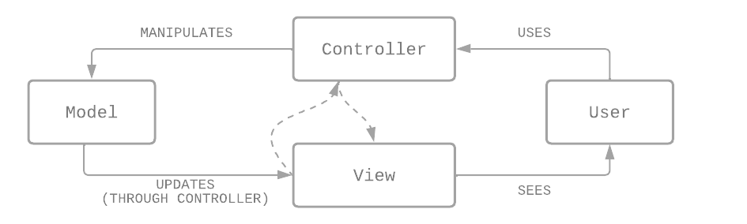

# BE 1.4 MVC
{: .fs-9 .fw-700 .no_toc }

## Table of contents
{: .no_toc .text-delta }

- TOC
{:toc}

---

PHP MVC är ett pattern/mönster som separerar applikationsdata och logik (model) från det vi ser (view). MVC står för **Model, View, Controller**. Controllen styr kommunikationen mellan model och view.

---

## Filstruktur

**MVC** - ett sätt att organisera sitt project.

Tre mappar i projektets root:
- **models** - filer som hanterar och behandlar data
- **views** - innehåller mallar (templates) för hur vår data ska representeras visuellt
- **controllers** - hanterar och bearbetar requests, avgör vilken data som ska användas och hur en lämplig template ska renderas

#### MVC exempel när en användare registrerar sig på en HTML-sida
{:.no_toc}

1. Användaren skickar användarnamn och löserord till servern *(URL: `localhost/create-user.php`)*
2. Router i `index.php` tar emot requesten *(OBS! i en router så går alla filer till samma URL, d.v.s. index)*
3. Routern skickar vidare till en controller
4. Controllern anropar models metod `create_user`
5. Controllern ger sen tillbaka ett svar till användaren genom att anropa en view

### Model

- Hanterar allt som har med databaser att göra
- En model refererar till en tabell, t.ex. så refererar dokumentet `user.php` till tabellen `users`
- När vi har hämtat datan från tabellen för en `user` och sparat i ett PHP-objekt (associativ array), då har vi ett model-objekt
- All hantering för CRUD i databasen ska ligga i varje `model`
- En model/fil för varje tabell vi har

### Controller

- Här ligger logiken för allt vi vill göra
- Spindeln i nätet
- Hanterar data som skickas in av användaren (förfrågan), då anropar controllern modelen
- Funktioner för att åstakomma någonting/utföra något

### View

- Allt vi ser på skärmen, som "skickas tillbaka" (data)
- Antingen HTML eller JSON
- En view kan t.ex. vara HTML; "grattis du är registrerad på sidan"
- Får sin data via model

### Router

- Dirigerar vilken controller som ska köras
- Finns ofta i `index.php`
- Skickar vidare koden dit den ska
