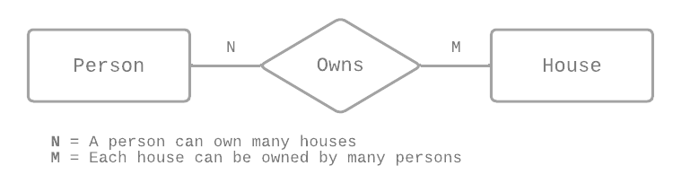
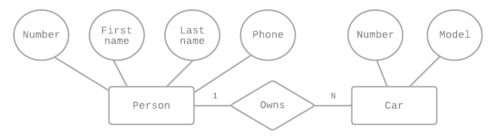

# BE 1.6 Heirarkiska databaser <br> BE 1.7 Relationsdatabaser, SQL och ER-modellering
{: .fs-9 .fw-700 .no_toc }

## Table of contents
{: .no_toc .text-delta }

- TOC
{:toc}

---

## Hierarkisk databasmodell

Den hierarkiska databasmodellen är den äldsta typen av data modell. Den utvecklades av IBM 1968, och organiserar data i en trädliknande struktur. Den är uppbyggd enligt följande:

- Noder som är sammankopplade med grenar
- Den översta noden kallas "root node"
- Om det finns flera noder på översta nivån kallas de "root segment"
- Varje node har endast en förälder-node
- En förälder-node kan ha flera barn-noder


---

## Relationsdatabasmodell

Relational Database Management System (RDBMS) utvecklades av E.F. Codd 1970. Det finns inga fysiska länkar som i hierarkiska databaser, istället är de strukturerade enligt följande:

- Data presenteras i form av tabeller
- Den handlar bara om data, inte fysisk struktur
- Den innehåller information om metadata
- Tabeller kan ha inbördes relationer till varandra
- Data sparas som poster/items i rader i tabeller
- Tabeller relaterar till varandra via kolumnvärden
- Behandlar queries väldigt enkelt


---

## SQL

Structured Query Language (SQL) är ett standard query-språk för att kommunicera med och manipulera databaser. Även om SQL är standardiserat enligt ANSI/ISO, så finns det ändå olika versioner av språket. Grunderna har de flesta dock gemensamt. [^1]

Med SQL kan vi till exempel skapa, hämta, uppdatera och radera data i relationsdatabaser, skapa nya databaser och tabeller samt sätta permissions/rättigheter.

### Konventioner

- Stora bokstäver i nyckelord (t.ex **SELECT** inte **select**)
- Attribut och variabler med gemener
- Lägg till plural S i tabellnamn (**books** inte **book**)
- Skriv tabellnamn med snake_case
- Dela upp långa statements i flera rader (max 80 tecken per rad)

#### Datatyper [^2]

| Namn | Exempel | Beskrivning |
|-|-|-|
| **INT** | id **INT** | För heltal (-2 147 483 648 till 2 147 483 647)                 |
| **VARCHAR** | firstname **VARCHAR(255)** | För strängar upp till 255 tecken långa, men kan vara kortare |
| **CHAR** | isbn **CHAR(13)** | För strängar som är exakt 13 tecken långa |
| **SMALLINT** | stock **SMALLINT** | För mindre heltal (-32 768 till 32 767) |
| **FLOAT** | price **FLOAT** | För decimaltal (flyttal) med noggrannhet ner till 23 decimaler |
| **ENUM()** | type **ENUM('basic', 'premium')** | För att använda ett av de fördefinierade alternativen |

#### Restriktioner

Undviker att logiska fel uppstår i våra tabeller, och hjälper även till med relationer mellan tabeller.

| Namn | Exempel | Beskrivning |
|-|-|-|
| **NOT NULL** | id INT **NOT NULL** | Värden i denna kolumn får inte innehålla NULL |
| **UNSIGNED** | id INT **UNSIGNED** NOT NULL | Värden för denna kolumn ska inte innehålla negativa tal, detta innebär att INT nu kan lagra dubbelt så stort tal (då vi bortser från den negativa delen) |

#### Nycklar/keyes

Speciella restriktioner som hjälper till att mer finkornigt styra vad som får läggas till i tabeller, men även hur de *relaterar* till varandra. Det finns fyra olika nycklar i SQL.

| Namn | Exempel | Beskrivning |
|-|-|-|
| **PRIMARY_KEY** | id INT NOT NULL **PRIMARY KEY** | Hanterar att vi endast får unik info från en tabell. Med en primary kay kan en rad inte innehålla samma värde och värdet kan inte vara null. |
| **FOREIGN_KEY** | **FOREIGN KEY** (book_id) REFERENCES books(id), | Värdet i denna kolumn är satt till foreign/extern nyckel, vilket innebär att värdet är en referens till en annan tabells primary key kolumn. |
| **UNIQUE** | isbn CHAR(13) **UNIQUE**(isbn) | Värdet för denna kolumn måste vara unikt i tabellen där kolumnen existerar. |
| **INDEX** | ALTER TABLE books ADD **INDEX**(title); | Skapar ett index för kolumnen i tabellen. Användbart för värden som vi vet kommer att hämtas ofta. |

---

## MySQL syntax

### Skapa ny databas med MySQL

#### Skapa
{:.no_toc}

```sql
CREATE DATABASE bookstore;
```

#### Välj vilken databas vi ska jobba i
{:.no_toc}

```sql
USE bookstore;
```

#### Skapa tabellen **books**
{:.no_toc}

```sql
CREATE TABLE books (
   title VARCHAR(255) NOT NULL, 
   author VARCHAR(255) NOT NULL,
   isbn CHAR(13) NOT NULL,
   stock SMALLINT UNSIGNED NOT NULL DEFAULT 0,
   price FLOAT UNSIGNED
);
```
#### Skapa tabellen **customer**
{:.no_toc}

```sql
CREATE TABLE customers(
   id INT UNSIGNED NOT NULL,
   firstName VARCHAR(255) NOT NULL,
   surName VARCHAR(255) NOT NULL,
   email VARCHAR(255) NOT NULL,
   type ENUM('basic', 'premium')
);
```

### Lägg till och ändra i befintlig tabell

#### Lägg till ny kolumn
{:.no_toc}

```sql
ALTER TABLE books
  ADD id INT UNSIGNED NOT NULL AUTO_INCREMENT PRIMARY KEY FIRST;
```

#### Ändra i tabell
{:.no_toc}

```sql
ALTER TABLE customers
  ADD UNIQUE KEY (email);
```

#### Lägg till data i tabell
{:.no_toc}

```sql
INSERT INTO customers (firstName, surName, email, type)
  VALUES ("Vilgot", "Stenwall", "vilgot@datainternet.it", "premium");
```

(`id` är ju auto-increment så den ska inte skrivas in utan mySQL genererar automatiskt)

### Läsa/hämta från tabell

#### Se hur tabellen ser ut
{:.no_toc}

```sql  
DESC books
```
genererar:

| Field  	| Type                 	| Null 	| Key  	| Default 	| Extra          	|
|--------	|----------------------	|------	|------	|---------	|----------------	|
| id     	| int(10) unsigned     	| NO   	| PRI  	| NULL    	| auto_increment 	|
| title  	| varchar(255)         	| NO   	| NULL 	|         	|                	|
| author 	| varchar(255)         	| NO   	| NULL 	|         	|                	|
| isbn   	| char(13)             	| NO   	| NULL 	|         	|                	|
| stock  	| smallint(5) unsigned 	| NO   	| 0    	|         	|                	|
| price  	| float unsigned       	| YES  	| NULL 	|         	|                	|	

#### Hämta alla items i tabell
{:.no_toc}

```sql
SELECT * FROM customers;
```

genererar:

| id 	| firstName 	| surName  	| email                  	| type    	|
|----	|-----------	|----------	|------------------------	|---------	|
| 1  	| Vilgot    	| Stenwall 	| vilgot@datainternet.it 	| premium 	|

---

## ER-modellering och samband

Schema för databaser och tabeller, det vill säga "mallen" för hur de ska se ut, skissas upp med så kallad ER-modellering. ER = Entity Relationship.

### Symboler

- **Entitetstyper**	- själva tabellen, ritas med rektanglar, kan ha attribut


- **Attribut** - kolumnerna i tabellen, ritas med cirklar och pilar ut från entitetstypen


- **Sambandstyper** - referensattribut, besrkriver relationer mellan tabeller/entitetstyper, ritas som diamanter


### Kardinalitetsförhållanden

Sambandstyper kan förtydligas och har tre typer av kardinalitetsförhållanden:

- **N:1/många-till-ett**

  Räknas som samma typ som 1:N/en-till-många

	
- **1:1/ett-till-ett**

	
- **N:M/många-till-många**

  Med N:M skapas en mellantabell för att redogöra för relationen mellan entiteterna

### Göra tabell av ett schema

Varje entitetstyp blir tabeller, och attribut blir kolumner.

#### Schema
{:.no_toc}


#### Tabell
{:.no_toc}

<div style="width: 550px;" markdown="1">

| number | first_name | last_name | phone |
|---|---|---|---|
| 11 | Omar | Faki | 555-123 33 99 |
| 12 |Hamadh | Hashim | 08-102 030 45 |
| 5554 | Nivah | Arakash | 555-123 33 44 |
| 1241 | Fake | Sandakelium | 555-123 99 99 |

</div>

### N:1 och 1:1

Varje sambandstyp blir ett referensattribut. Kolumnen *owner* i tabellern *car* hänvisar till kolumnen *number* i tabellen *person*.

#### Schema
{:.no_toc}



#### Tabeller
{:.no_toc}

**person**
<div style="width: 550px;" markdown="1">

| number | first_name | last_name | phone |
|---|---|---|---|
| 11 | Omar | Faki | 555-123 33 99 |
| 12 | Hamadh | Hashim | 08-102 030 45 |
| 5554 | Nivah | Arakash | 555-123 33 44 |
| 1241 | Fake | Sandakelium | 555-123 99 99 |

</div>

**car**
<div style="width: 450px;" markdown="1">

| number | model | owner |
|---|---|---|
| ABC123 | Volvo V70| 11 |
| DEF456 | Tesla Model Y| 5554 |
| GHI789 | Kia Sportage | 5554 |

</div>

### N:M

Sambandstypen blir en mellantabell/pivot table.

#### Schema
{:.no_toc}


#### Tabeller
{:.no_toc}

**person**
<div style="width: 550px;" markdown="1">

| number | first_name | last_name | phone |
|---|---|---|---|
| 11 | Omar | Faki | 555-123 33 99 |
| 12 | Hamadh | Hashim | 08-102 030 45 |
| 5554 | Nivah | Arakash | 555-123 33 44 |
| 1241 | Fake | Sandakelium | 555-123 99 99 |

</div>

**house**
<div style="width: 300px;" markdown="1">

| number | color |
|---|---|
| 1 | green |
| 2 | red |
| 3 | blue |
| 4 | white |

</div>

**owns**
<div style="width: 300px;" markdown="1">

| person | house |
|---|---|
| 11 | 1 |
| 11 | 3 |
| 5554 | 4 |
| 1241 | 1 |

</div>

---

## Referenser

[^1]: [W3Schools - Introduction to SQL](https://www.w3schools.com/sql/sql_intro.asp)
[^2]: [MySQL - Data Types](https://dev.mysql.com/doc/refman/5.7/en/data-types.html)