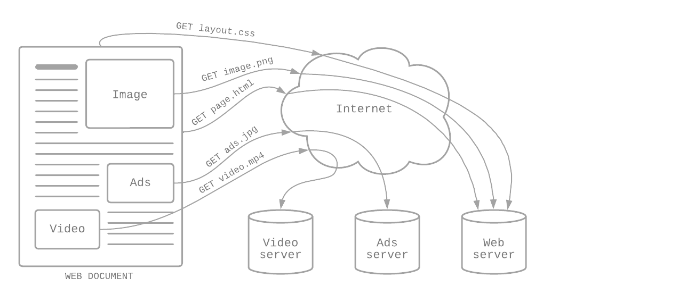

# BE 1.9 HTTP-protokollet
{: .fs-9 .fw-700 .no_toc }

## Table of contents
{: .no_toc .text-delta }

- TOC
{:toc}

---

HTTP är ett protokoll för att hämta resurser/dokument. Det är ett så kallad *client-server protocol*, vilket innebär att förfrågan att hämta skickas från mottagaren/klienten (browsern här). Ett hämtat dokument består ofast av en mängd olika dokument och resurser, som text, bilder, videos, scripts etc. [^1]



---

## HTTP request

En HTTP-request/förfrågan består av: [^1]

- En HTTP-metod, se nedan
- Pathen till resursen som ska hämtas, vilket i princip är URL:en minus protokollet (`https://`), domänen (`localhost` i exemplen nedan, men oftast en extern såklart) eller TCP-porten (`3333` i exemplen nedan)
- Versionen av HTTP-protokollet
- Eventuellt `headers` med ytterligare information till servern
- Eventuellt `body`, för metoder som till exempel `POST`, som innehåller resursen som skickas

---

## HTTP response

Ett HTTP-response/svar består av: [^1]

- Versionen av HTTP-protokollet
- En statuskod som visar på om requesten lyckades eller inte, och varför
- Ett statusmeddelande typ en kort beskrivning av statuskoden
- Eventuellt `headers`, likt för requesten
- Eventuellt `body` med resuresen som efterfrågades i requesten

### Statuskoder

Statuskoder i HTTP-responses är indelade i fem klasser: [^2]

- Informations svar (100-199)
- Lyckade svar (200-299)
- Omdirigeringsmeddelanden (300-399)
- Client error svar (400-499)
- Server error svar (500-599)

#### Exempel på några vanliga statuskoder
{:.no_toc}

- `200` - **OK**, requesten lyckades
- `201` - **Created**, resurs skapad
- `400` - **Bad Request**, servern hanterar inte requesten pga problem i klienten
- `401` - **Unauthorized**, egentligen *unauthenticated*, klienten måste autentisera sig själv för att kunna skicka requesten
- `403` - **Forbidden**, servern vet vem klienten är (till skillnad från `401`), men klienten har inte rätt tillstånd för att skicka requesten
- `404` - **Not Found**, resursen (URL:en i browsern) hittades inte
- `500` - **Internal Server Error**, servern har stött på ett okänd problem

---

## HTTP request metoder

Det finns flera olika metoder för att skicka requests. Nedan är några av de vanligaste. [^3]

### GET

Skickas ofta via URL:en. Bör bara användas för att hämta data, aldrig skicka data, då parametrarna syns i URL:en.

#### Exempel
{:.no_toc}

```js
function getList() {
  fetch("http://localhost:3333/list")
    .then((data) => data.json());
}
```

### POST

Skapa resurser, skickar data till servern, oftast via HTML-formulär. Vilken data det är syns inte i URL:en utan är dold.

#### Exempel
{:.no_toc}

```js
function setItem(item) {
  fetch("http://localhost:3333/list"), {
    method: "POST",
    headers: {
        "Content-Type": "application/json",
    },
    body: JSON.stringify({item})
  }
  .then((data) => data.json());
}                        
```

### PUT

Skickar också data till servern, används ofta för att uppdatera data. Till skillnad från `POST` så gör det ingenting om `PUT` skickas flera gånger. Till exempel kan du skapa en användare via `POST`, skickar du den requesten flera gånger så skapas flera användare. Med `PUT` kan du till exempel uppdatera ditt användarnamn, men där gör det ingen skillnad som samma requests råkar skickas flera gånger (`PUT` har inga sidoeffekter och ändrar helt enkelt samma sak om och om igen)

#### Exempel
{:.no_toc}

```js
function editItem(id, item) {
  fetch("http://localhost:3333/list/"+id), {
    method: "PUT",
    headers: {
      "Content-Type": "application/json", 
    },
    body: JSON.stringify({item})
  }
  .then((data) => data.json());
}
```

### DELETE

Raderar en specifik resurs från servern/databasen, till exempel om du vill radera ett inlägg du har gjort på någon sida.

#### Exempel
{:.no_toc}

```js
function setItem(id) {
  fetch("http://localhost:3333/list/"+id), {
    method: "DELETE",
    headers: {
      "Content-Type": "application/json", 
    },
    body: JSON.stringify({id})
  }
  .then((data) => data.json());
}  
```

Utöver de tidigare nämnda metoderna finns: HEAD, CONNECT, OPTIONS, TRACE och PATCH.

---

## Referenser

[^1]: [MDN Web Docs - An overview of HTTP](https://developer.mozilla.org/en-US/docs/Web/HTTP/Overview)
[^2]: [MDN Web Docs - HTTP response status codes](https://developer.mozilla.org/en-US/docs/Web/HTTP/Status)
[^3]: [MDN Web Docs - HTTP request methods](https://developer.mozilla.org/en-US/docs/Web/HTTP/Methods)