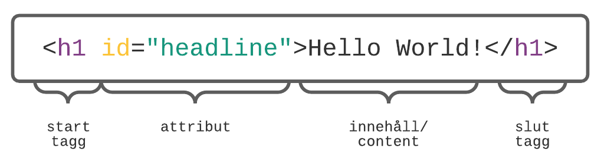

# HC 1.1 HTML & CSS -- HTML
{: .fs-9 .fw-700 .no_toc }

## Innehåll
{: .no_toc .text-delta }

- TOC
{:toc}

---

HTML står för HyperText Markup Language. Markup Language = “märkspråk”, för att märka upp delar av text. Texten tolkas av webbläsaren, och översätter det till det vi ser på skärmen. HTML skrivs som dokument, och är uppbyggt av element med taggar (`<>`) och innehåll. Dokumentets filnamn slutar med `.html`.

W3C har standardiserat markup-språket, och nuvarande iteration är ganska fritt och inte så strikt, där de flesta browsers fyller i eventuella fel. Nuvarande standard är HTML 5.2 (HTML5).

---

## STRUKTUR

Det finns en tydlig uppbyggnad/struktur för hur HTML-dokument skrivs:
```html
<!DOCTYPE html> // anger att vi använder HTML 5
<html> // rotelement, innehåller hela dokumentträdet
<head> // innehåller metadata, inget av detta är synligt på sidan
   <title>Sidans titel</title> // titeln som visas högst upp i browserfönstret
</head> // slut tagg för head
<body> // allt innehåll som ska synas på sidan skrivs inom body taggen
  
</body> // slut tagg för head
</html> // slut tagg för body
``` 

Så här är ett html-element uppbyggt:


---

## ELEMENT

### BLOCKNIVÅ vs. INLINE NIVÅ
### INLINE-ELEMENT

---

## KOMMENTARER

---

## ENTITETER

---

## TABELLER

---

## FORMULÄR
### MAIL- OCH TELEFONLÄNKAR