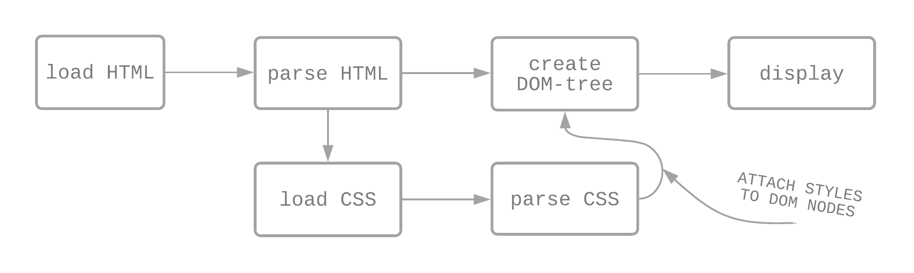

# HC 1.1-2 CSS
{: .fs-9 .fw-700 .no_toc }

## Table of contents
{: .no_toc .text-delta }

- TOC
{:toc}

---

CSS står för Cascading Style Sheet, och är språket som HTML stylas med. I browsern kombineras HTML och CSS till DOM:en (Document Object Model) som sedan visas för användaren.



---

## Syntax

CSS består av deklarationsblock där HTML:n som ska stylas anges med selectors (selektorer) och själva stylingen består av property-value par (deklaration).

#### Deklarationsblock
{:.no_toc}


## CSS-selektorer

### Enkla selektorer

Matchar ett eller flera element baserat på element-typ, id eller class.

#### Exempel för elementet `<p>`: 
{:.no_toc}
```css
p {
    color: green;
}
```
#### Exempel för element med `class="red-text"`:
{:.no_toc}
```css
.red-text {
    color: red;
}
```
#### Exempel för element med `id="blue-text"`:
{:.no_toc}
```css
#blue-text {
    color: blue;
}
```

### Attribut selektorer

Matchar ett eller flera element baserat på deras attribut och attribut värden/values.

#### Exempel för element med attribut `data-vegetable=""` (oavsett value):
{:.no_toc}
```css
[data-vegetable] {
    color: green;
}
```
#### Exempel för element med attribut `data-meat="replace quorn"` (attribut + specifikt value):
{:.no_toc}
```css
[data-meat="replace quorn"] {
    color: peru;
}
```
#### Exempel för element med attribut `lang` och value som *innehåller eller börjar med* `"sv"` (attribut + innehåller/börjar med specifikt value):
{:.no_toc}
```css
[lang|="sv"] {
    color: aquamarine;
}
```
#### Exempel för element med attribut `data-quantity` och value som *slutar med* `"kg"` (attribut + slutar med specifikt value):
{:.no_toc}
```css
[data-quantity$="kg"] {
    font-weight: bold;
}
```
#### Exempel för element med attribut `data-quantity` och value som *innehåller* `"gr"` (attribut + innehåller specifikt value):
{:.no_toc}
```css
[data-quantity*="gr"] {
    text-decoration: underline;
}
```
#### Exempel för element med attribut `data-quantity` och value som *börjar med* `"optional"` (attribut + börjar med specifikt value):
{:.no_toc}
```css
[data-quantity^="optional"] {
    opacity: 0.3;
}
```

### Pseudo-klasser

Matchar ett eller flera element som existerar i ett visst tillstånd, t ex när en hovrar över.

#### Exempel för element `<a>` och en hovrar över:
{:.no_toc}
```css
a:hover {
    color: purple;
}
```
#### Exempel för att lägga till pseudo-element i DOM:en *efter* valda elementet:
{:.no_toc}
```css
div::after {
    content: " efter";
}
```

### Kombinationer

Ingen egen selektor utan kombinerar flera selektorer för att få väldigt specifika selektioner av element eller grupper av element.

#### Exempel för alla element `<p>` som är child till (nestlade i) `<section>` (och alla child under):
{:.no_toc}
```css
section p {
    color: green;
}
```
#### Exempel för alla element `<p>` som är *direkt* child till (nestlade i) `<section>`:
{:.no_toc}
```css
section > p {
    color: yellow;
}
```
#### Exempel för det element `<p>` som *följer direkt* efter `<h2>`(närmsta syskonet):
{:.no_toc}
```css
h2 + p {
    text-transformation: uppercase;
}
```
#### Exempel för alla element `<p>` som *följer efter* `<p>` (alla efterföljande i syskonskaran):
{:.no_toc}
```css
h2 ~ p {
    border: 1px solid black;
}
```

### Multipla selektorer

Ingen egen typ av selektor utan flera selektorer på samma regel, separerade med kommatecken, som på så sätt kan applicera en uppsättning deklarationer på alla element selektorerna väljer.

#### Exempel för alla element `<h2>`, `<p>` och `<a>`:
{:.no_toc}
```css
h2,
p,
a {
    color: blue;
}
```

---

## Positionering

Förutom det uppenbara i att ändra färger, typsnitt och storlekar på element och texter, handlar CSS också till stor del om positionering. Mer om det under [responsiv design]({{ site.baseurl }}).
