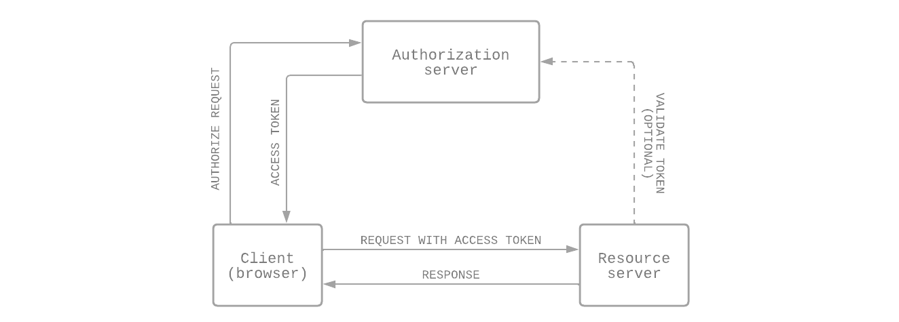

# JS 1.12 OAuth från frontend
{: .fs-9 .fw-700 .no_toc }

## Table of contents
{: .no_toc .text-delta }

- TOC
{:toc}

---

## Vad är OAuth?

OAuth (Open Authorization) är ett standard protokoll för hur en webbapplikation får tillgång till en skyddad server. Istället för att klienten (browsern) pratar direkt med den skyddade servern, så kommunicerar den med ett AS (Authorization Server) som mellanhand. Om AS:et godkänner förfrågan från klienten så gör den en access token, som klienten skickar med i alla requests till servern. Servern validerar tokenen, och om den får godkänt returnerar den svaret på requesten tillbaka till klienten. [^1]

---

## Tokens

OAuth använder access tokens och refresh tokens.

### Access tokens

När en användare loggar in på din sida, så gör AS:et en access token som applikationen använder för att kunna anropa servern säkert. Om applikationen behöver komma åt skyddad data åt en användare, så talar access tokenen om för servern att klienten har authoriserat användaren. Av säkerhetsskäl så är en access token ofta bara valid/giltig en kort tid. [^2]

### Refresh tokens

När en access token inte är giltig längre, så kan klienten använda en refresh token för att få en ny access token, utan att användaren behöver logga in igen. En refresh token är ofta giltig betydligt längre tid än en access token.

För att hindra att någon stjäl din refresh token och på så sätt får din access token, så gör OAuth så att varje gång klienten skickar en refresh token för att förnya en access token, så svarar AS:et med *både* en ny access token *och* en ny refresh token att använda nästa gång. [^2]

### JWT (JSON Web Tokens)

OAuth använder JWT. En token som följer JWT-strukturen är i encodat JSON-format. Det går att baka in diverse information i en token som sedan kan decodas och läsas.

Specifikationen för en JWT är uppdelad i tre delar: [^1]

- **Header** har information om algoritmen som används för att signera tokenen.
- **Signature** är en kombination av data, signerad av en private key hos AS:et (som också tillhandahåller den publika keyn). Genom att verifiera signaturen med den publika nyckeln behöver inte servern prata med AS:et för att validera tokenen.
- **Payload** innehåller informationen din applikation behöver för authentication och authorization i form av key/value-par.

---

## Referenser

[^1]: [Han Wang - How to Implement OAuth 2.0— Part 1. What Is OAuth](https://medium.com/@hwang74/how-to-implement-oauth-2-0-part-1-what-is-it-and-should-i-write-my-own-b47567cf1ee9)
[^2]: [Dan Arias & Sam Bellen - What Are Refresh Tokens and How to Use Them Securely](https://auth0.com/blog/refresh-tokens-what-are-they-and-when-to-use-them/)