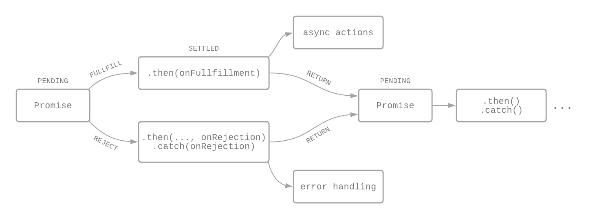

# JS 1.3 Promises
{: .fs-9 .fw-700 .no_toc }

## Table of contents
{: .no_toc .text-delta }

- TOC
{:toc}

---

Ett `Promise` är ett object i JavaScript som kan producera ett värde i framtiden, det vill säga en asynkron operation. [^1] Istället för att direkt returnera värdet av en metod, så returnerar en asynkoron metod ett löfte (promise) om att leverera ett värde i framtiden.

---

## States

Ett promise kan ha ett av följande states:

- **pending** - väntar på resultat
- **fulfilled** - lyckades hämta resultat
- **rejected** - misslyckades hämta resultat

Ett pending promise kan alltså antingen bli fulfilled med ett värde eller rejected med en error. När ett promise inte längre är pending så kallas det att det är *settled*. [^1]

---

## Syntax

Exempel på en funktion som returnerar ett promise som resolvas efter en specifik delay:

```js
const wait = (time) => {
	new Promise((resolve) => {
		setTimeout(resolve, time);
	})
}
wait(3000).then(() => console.log('Hejsan!'));
```

Promise konstruktiorn tar två funktioner; `resolve()` och `reject()` (i exemplet ovan används enbart `resolve`). Det går också att resolva/rejecta/settla med värden, som sedan passas till funktionerna i `then()`.

---

## `then()` och `catch()`

När ett promise har blivit settled, kallas de handlers som vi har i den inbyggda metoden `then()`. Metoden tar två argument där den första är en callback function vid resolved och den andra vid rejected. [^2] Varje `then()`-metod returnerar ett nytt genererat promise-objekt, och kan därför chainas (mer om det nedan).

Den inbyggda metoden `catch()` tar bara en callback funktion vid reject. Om vi inte har en error som måste hanteras direkt så kan vi spara hanteringen av reject tills vi kommer till `catch()` i kedjan (efter eventuellt flera chainade `then()`).

---

## Chaining

Promises kan chainas så att det går att göra saker med de värden en antar ska dyka upp. Returvärdet av varje resolvat promise (och errorn från varje rejectat) skickas vidare till nästa `then()`.



Exempel på chainat promise med flera `.then`-metoder:

```js
wait
	.then(handleResolvedA, handleRejectedA)
	.then(handleResolvedB, handleRejectedB)
	.then(handleResolvedC, handleRejectedC)
	.catch(handleRejectedD);
```

---

## Referenser

[^1]: [Eric Elliott - Master the JavaScript Interview: What is a Promise?](https://medium.com/javascript-scene/master-the-javascript-interview-what-is-a-promise-27fc71e77261#:~:text=A%20promise%20is%20an%20object,fulfilled%2C%20rejected%2C%20or%20pending.)
[^2]: [MDN Web Docs - Promise](https://developer.mozilla.org/en-US/docs/Web/JavaScript/Reference/Global_Objects/Promise)