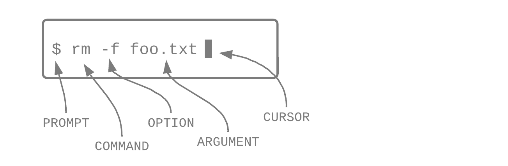
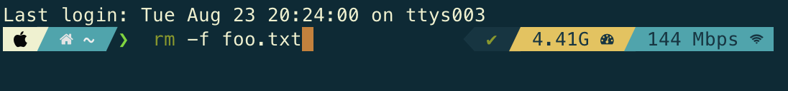
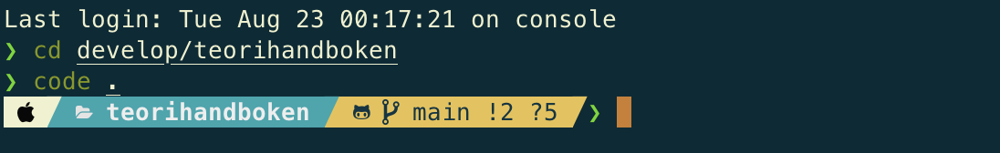

# PG 1.11 Terminalinterface
{: .fs-9 .fw-700 .no_toc }

## Table of contents
{: .no_toc .text-delta }

- TOC
{:toc}

---

Command-line interface (CLI) är ett textbaserat gränssnitt med vilket du kan prata med datorn via text. Du kan skapa/ändra/radera filer och mappar, köra program och navigera på datorn.

#### Termer
{:.no_toc}

- **Shell** - refererar till ett CLI, själva programmet som exekverar kommandon du skriver in
- **Terminal** - CLI programmet som finns med i en Mac dator
- **Command Prompt** - CLI programmet som finns med i en Windows dator (obs, fungerar annorlunda än CLI på Mac/Linux)
- **Bash** - ett typ av shell, står för *Bourne-again Shell*, vanligt på Linux
- **Zsh** - ett shell som är baserat på bash, förkortning av *Z shell*, går att anpassa mer än bash, numera standard på Mac

Några olika andra shells: csh (C Shell), tsh (variant av C Shell med utökad funktionalitet), ksh (KornShell), dash (Debain Almquist Shell).

---

## Fördelar

När du väl har lärt dig att navigera runt på datorn via text i ett CLI, så går det väldigt mycket fortare än att klicka sig runt i det visuella gränssnittet. Det är också mer effektivare, du kan direkt göra det du vill utan att gå omvägar via klick åt olika håll. Du kan också anpassa ditt shell med kortkommandon, alias och olika plugins (som auto completion) vilket gör att det går ännu fortare. Det är också lättare att komma åt root rättigheter på datorn, ändra i rättigheter i filer och mappar och att navigera bland dolda filer.

---

## Anatomi

Det finns ett antal komponenter till kodande i ett CLI: en prompt, ett kommando att köra, options/flags och argument/parametrar. [^1]

#### Prompt
{:.no_toc}

Prompten skriver du inte in, utan terminaler börjar alltid med en prompt, oftast **$** eller **%**. Det går att anpassa prompten på olika sätt, och det kan också vara olika prompts beroende på vilket program eller miljö du är i.

#### Kommando
{:.no_toc}

Här säger du åt datorn vad den ska göra. Några vanliga exempel på kommandon:

- `cd` - change directory, gå in i en mapp
- `open` - öppna filer
- `mv` - move, flytta filer
- `mkdir` - make directory, skapa en mapp
- `touch` - ändrar filers timestamp, men används vanligen för att skapa en ny fil
- `ls` - listar alla filer och mappar i mappen/directoryn du befinner dig

#### Options/flags
{:.no_toc}

Flaggor är som tillägg till kommandon för att specificera olika saker. Till exempel, om du vill lista alla filer och mappar med kommandot `ls`, så kan bland annat använda följande flaggor:

- `-l` - visar rättigheter, vilken användare som har skapat filen/mappan och andra detaljer
- `-a` - visar även dolda filer och mappar
- `-S` - sorterar filer efter storlek, med den största först
- `-C` - listar filer och mappar i kolumner

#### Argument
{:.no_toc}

Kan vara bland annat sökvägar till filer, användarnamn, lösenord eller annan info. Argument och parametrar används bara ibland.

---

## Anpassning

Som det står ovan så går det att anpassa prompten och shellet på en massa olika sätt. Jag har till exempel Oh My Zsh, som är ett ramverk till zsh, och till det har jag ett tema som heter PowerLevel10k. Jag använder inte heller Macs inbyggda program, Terminal, utan ett annat som heter iTerm, som går att anpassa lite mer visuellt med färger etc (något jag har gjort).

#### Exempel
{:.no_toc}

Kommandot ovan FreeBSD:

Samma kommando i min CLI:

Här har jag gått in i mappen för det här projektet och öppnat det i VSCode med kommandot `code .`. Jag har också tillägg till Git, så det går att se tydligt vilken branch jag är på, samt annan info som antal filer med ändringar, förändringar mot remote etc. Jag använder samma terminal i VSCode också.

---

## Referenser

[^1]: [Learn to code with me: Command Line for Beginners](https://learntocodewith.me/learn/command-line/)
