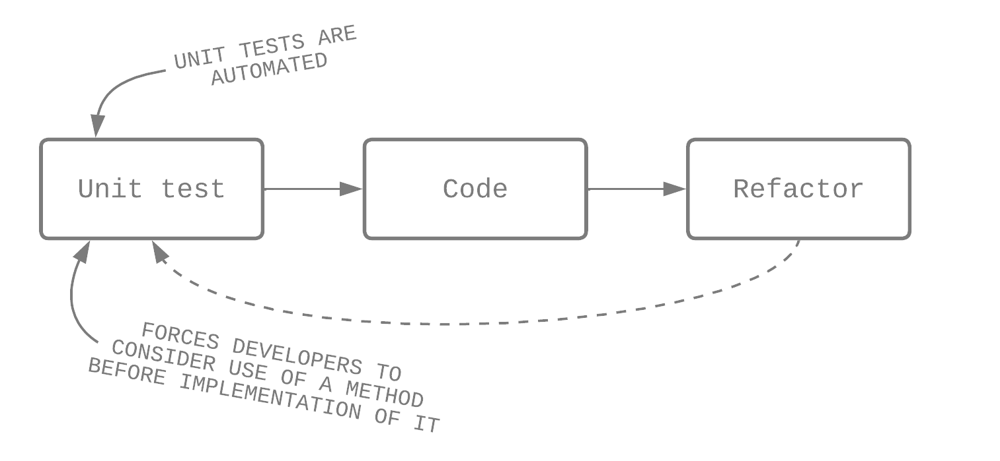
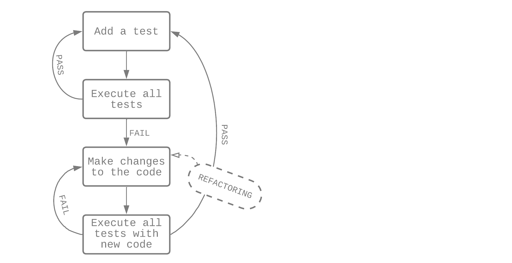

# PG 1.3 Testdriven utveckling
{: .fs-9 .fw-700 .no_toc }

## Table of contents
{: .no_toc .text-delta }

- TOC
{:toc}

---

## Vad är testdriven utveckling?

Testdriven utveckling (TDD, *Test Driven Development*) är en metod för utveckling av mjukvara, där olika test cases tas fram för att specificera och validera koden. Ett test tas fram för varje funktionalitet i koden, och om testet misslyckas så skrivs koden om för att klara testet.

Om vi utvecklar testdrivet, så börjar vi med att designa och utveckla tester för varje liten funktionalitet i applikationen. Ifall ett test misslyckas skriver vi sedan om koden och ändrar tills det fungerar, innan vi skriver ny kod. När vi så skriver väldigt lite kod åt gången undviker vi att upprepa oss, och koden blir från början väldigt enkel och bugg-fri. Det finns olika TDD-ramverk som automatiserar testningen och säger till om kod behöver skrivas om. [^1]

### Utföra ett TDD-test

Vi kan se det testdrivna workflowet som indelat i fem steg, som går runt i cykler:

1. Lägg till ett test
2. Exekvera alla tester och se om det nya testet lyckas
3. Gör eventuella förändringar i koden
4. Kör alla testerna igen med den nya koden
5. Upprepa

---

## Referenser

[^1]: [Thomas Hamilton - What is Test Driven Development (TDD)? Tutorial with Example](https://www.guru99.com/test-driven-development.html)