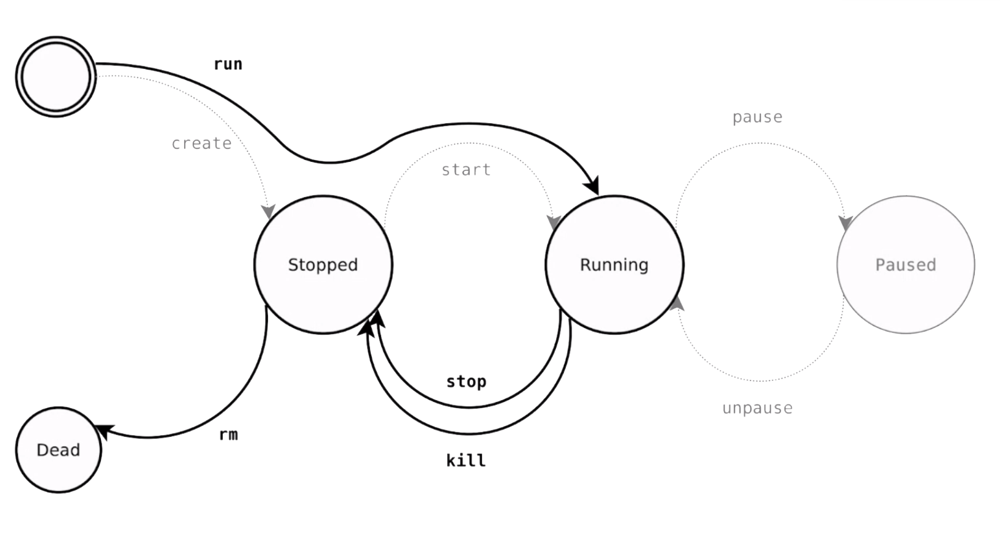

# PG 1.9 Virtualisering av utvecklingsmiljö
{: .fs-9 .fw-700 .no_toc }

## Table of contents
{: .no_toc .text-delta }

- TOC
{:toc}

---

- [https://www.youtube.com/watch?v=Gjnup-PuquQ](https://www.youtube.com/watch?v=Gjnup-PuquQ)

## Virtualisering

Kan användas för att synka olika utvecklares miljöer för att minimera risker för krockar och buggar. Den virtuella miljön kan synkas mellan utvecklare och också matcha live miljön när produkten går i produktion.

#### Fördelar
{:.no_toc}

- Portabel, delbar miljö
- Isolerar koden och konfigurationen från det egna systemet
	- Går att ha en egen konfiguration per projekt
- Deploybar uppsättning av applikationen
- Skalbart

### Container

Ett körbart paket av mjukvara som innehåller allt det behöver för att exekveras, som finns i en isolerad miljö (som ett eget OS).

- Kan byggas och köras oberoende av plattform
- Isolerar mjukvara från sin omgivning
	- Lättare att testa på ett annat sätt
	- Om något går sönder så går det sönder i containern, inte i ens egna OS
- Minimerar konflikter som kan uppstå i team
	- Olika lokala inställningar krockar inte

### Virtuell maskin

En abstraktion av fysisk hårdvara som kan få en dator eller server att bete sig som flera andra datorer/servrar. Som en låtsas dator i din dator. Vi kan ha flera olika virtuella maskiner, där varje maskin innehåller en hel kopia av ett OS.

- Full virtuell kopia av ett OS
- Kan skalas upp och ner i antal beroende på behov
- Kan innehålla flera olika typer av projekt
- Kan konfigureras med olika virtuell hårdvara
- Går att speca upp specifik hårdvara, det går inte i en container

---

## Varför behövs det?

Varför inte bara installera allt lokalt? MAMP, LAMP, LEMP etc.

- Lokala miljöer är svåra att dela med sig, hur den är uppsatt
- Går att köra allt lokalt om du är ensam utvecklare, men det kommer eventuellt bli knas vid deploy
- Kan bli svårt att flytta sig från en lokal miljö med vissa inställningar till en server med andra inställningar
- Svårt att synka olika utvecklares miljöer
- Väldigt svårt att konfigurera ett projekt som fungerar oavsett kontext
- Vi vill inte behöva vara beroende av en viss typ av hårdvara eller OS

---

## Leverantörer

- **Vagrant** - *virtualisering*
	- Open-source mjukvaruprodukt
	- Hantera portabla virtuella utvecklingsmiljöer
- **Docker** - *containers*
	- Leverantör med tjänsteutbud som kretsar kring containers och deras konfiguration
- **Kubernetes** - *containers*
	- Open-source, underlättar vid deploy, skalning och hantering av containers i olika mniljöer
	- Lite mer riktat mot deploy

---

## Docker

### Begrepp

- **Container**
	- En enhet av mjukvara, håller applikationen och dependencies
- **Image**
	- Mall över hur saker ska installeras och konfigureras
- **Dockerfile**
	- En textfil som Docker använder för att skapa images
	- Innehåller kommandon som är nästan identiska med terminalkommandon

### Kommandon

|Kommando|Beskrivning|
|-|-|
|`docker create [image] [kommando]`|skapa container|
|`docker run [image] [kommando]`|create + start|
|`docker rename [container] [nytt_namn]`|döper om container|
|`docker update [container]`|uppdatera konfiguration för containern|
|`docker start [container]`|starta|
|`docker stop [container]`|stoppa (gracefully)|
|`docker kill [container]`|stäng av (typ dra ut strömmen)|
|`docker restart [container]`|stop + start|
|`docker pause [container]`|pausa|
|`docker unpause [container]`|återuppta|
|`docker rm [-f] [container]`|ta bort container|
|`docker ps`|listar containers som körs|
|`docker ps -a`|listar alla containers (även pausade)|
|`docker logs [container]`|visa output för container loggar|
|`docker top [container]`|lista processerna som körs inuti containern|
|`docker stats [container]`|lista användningsstatistik|
|`docker diff [container]`|visa ändringar i container kontra image (modifierade filer)|
|`docker port [container]`|lista portar som mappats till containern|
|`docker inspect [container]`|visa docker-relaterad info i json-format|
