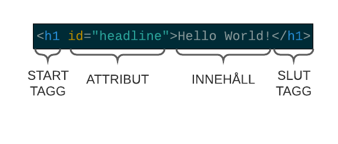
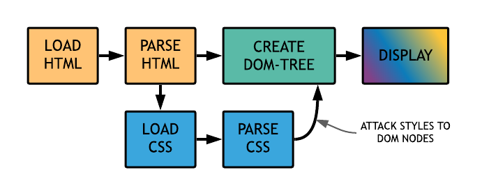

# Teorihandboken - HTML & CSS (HC)

###### Karin Stenwall FWD20

---

- [HC 1.1 HTML & CSS -- HTML](#hc-11-html--css----html)
- [HC 1.1 HTML & CSS -- CSS](#hc-11-html--css----css)
- [HC 1.2 Responsiv design](#hc-12-responsiv-design)
- [HC 1.3 Tillgänglighet inom webb](#hc-13-tillgänglighet-inom-webb)
- [HC 1.4 Aktuella webbstandarder](#hc-14-aktuella-webbstandarder)
- [HC 1.5 CSS Pre-processorer](#hc-15-css-pre-processorer)
- [HC 1.6 Optimering och validering](#hc-16-optimering-och-validering)


## HC 1.1 HTML & CSS -- HTML
HTML står för HyperText Markup Language. Markup Language = “märkspråk”, för att märka upp delar av text. Texten tolkas av webbläsaren, och översätter det till det vi ser på skärmen.

Nuvarande standard är HTML 5.2 (HTML5).

W3C har standardiserat markup-språket, och nuvarande iteration är ganska fritt och inte så strikt, där de flesta browsers fyller i eventuella fel.

HTML skrivs som dokument, och är uppbyggt av element med taggar (`<>`) och innehåll. Dokumentets filnamn slutar med `.html`.

### STRUKTUR

Det finns en tydlig uppbyggnad/struktur för hur HTML-dokument skrivs:
```html
<!DOCTYPE html> // anger att vi använder HTML 5
<html> // rotelement, innehåller hela dokumentträdet
<head> // innehåller metadata, inget av detta är synligt på sidan
   <title>Sidans titel</title> // titeln som visas högst upp i browserfönstret
</head> // slut tagg för head
<body> // allt innehåll som ska synas på sidan skrivs inom body taggen
  
</body> // slut tagg för head
</html> // slut tagg för body
``` 

Så här är ett html-element uppbyggt:


### ELEMENT

#### BLOCKNIVÅ vs. INLINE NIVÅ
#### INLINE-ELEMENT
### KOMMENTARER
### ENTITER
### TABELLER
### FORMULÄR
#### MAIL- OCH TELEFONLÄNKAR

## HC 1.1 HTML & CSS -- CSS
CSS står för Cascading Style Sheet



### CSS-SELEKTORER

#### ENKLA SELEKTORER

Matchar ett eller flera element baserat på element-typ, id eller class.

Exempel för elementet `<p>`: 
```css
p {
    color: green;
}
```
Exempel för element med `class="red-text"`:
```css
.red-text {
    color: red;
}
```
Exempel för element med `id="blue-text"`:
```css
#blue-text {
    color: blue;
}
```

#### ATTRIBUT SELEKTORER

Matchar ett eller flera element baserat på deras attribut och attribut värden/values.

Exempel för element med attribut `data-vegetable=""` (oavsett value):
```css
[data-vegetable] {
    color: green;
}
```
Exempel för element med attribut `data-meat="replace quorn"` (attribut + specifikt value):
```css
[data-meat="replace quorn"] {
    color: peru;
}
```
Exempel för element med attribut `lang` och value som *innehåller eller börjar med* `"sv"` (attribut + innehåller/börjar med specifikt value):
```css
[lang|="sv"] {
    color: aquamarine;
}
```
Exempel för element med attribut `data-quantity` och value som *slutar med* `"kg"` (attribut + slutar med specifikt value):
```css
[data-quantity$="kg"] {
    font-weight: bold;
}
```
Exempel för element med attribut `data-quantity` och value som *innehåller* `"gr"` (attribut + innehåller specifikt value):
```css
[data-quantity*="gr"] {
    text-decoration: underline;
}
```
Exempel för element med attribut `data-quantity` och value som *börjar med* `"optional"` (attribut + börjar med specifikt value):
```css
[data-quantity^="optional"] {
    opacity: 0.3;
}
```

#### PSEUDO-KLASSER

Matchar ett eller flera element som existerar i ett visst tillstånd, t ex när en hovrar över.

Exempel för element `<a>` och en hovrar över:
```css
a:hover {
    color: purple;
}
```
Exempel för att lägga till content till html via css, här för element med attribut `href` och ett value som börjar med `"http"` där det nya innehållet läggs till *efter* elementet:
```css
[href^="http"]::after {
    content: " efter";
}
```

#### KOMBINATIONER

Ingen egen selektor utan kombinerar flera selektorer för att få väldigt specifika selektioner av element eller grupper av element.

Exempel för alla element `<p>` som är child till (nestlade i) `<section>` (och alla child under):
```css
section p {
    color: green;
}
```
Exempel för alla element `<p>` som är *direkt* child till (nestlade i) `<section>`:
```css
section > p {
    color: yellow;
}
```
Exempel för det element `<p>` som *följer direkt* efter `<h2>`(närmsta syskonet):
```css
h2 + p {
    text-transformation: uppercase;
}
```
Exempel för alla element `<p>` som *följer efter* `<p>` (alla efterföljande i syskonskaran):
```css
h2 ~ p {
    border: 1px solid black;
}
```

#### MULTIPLA SELEKTORER

Ingen egen typ av selektor utan flera selektorer på samma regel, separerade med kommatecken, som på så sätt kan applicera en uppsättning deklarationer på alla element selektorerna väljer.

Exempel för alla element `<h2>`, `<p>` och `<a>`:
```css
h2,
p,
a {
    color: blue;
}
```

### POSITIONERING

## HC 1.2 Responsiv design

## HC 1.3 Tillgänglighet inom webb
### VARFÖR?
### SEMANTISKA ELEMENT

## HC 1.4 Aktuella webbstandarder 
(gällande och kommande standarder)

## HC 1.5 CSS Pre-processorer
(ex SASS/LESS)

## HC 1.6 Optimering och validering
av HTML & CSS

DRY KISS

Optimering - inte återupprepa sig, inte skriva samma sak flera ggr, typ inte skriv samma styling flera ggr. Minimera upprepningar. Hålla nere storleken på bilder.

Är den validerad så är den också mer optimerad.
